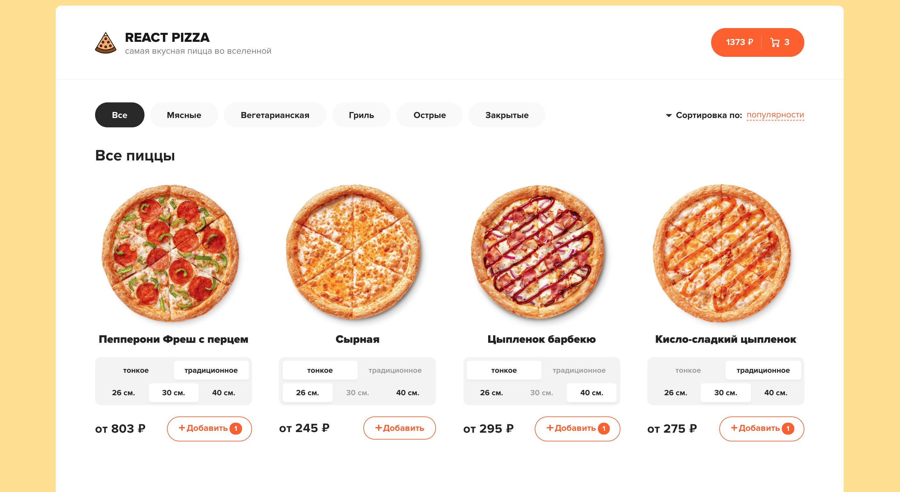
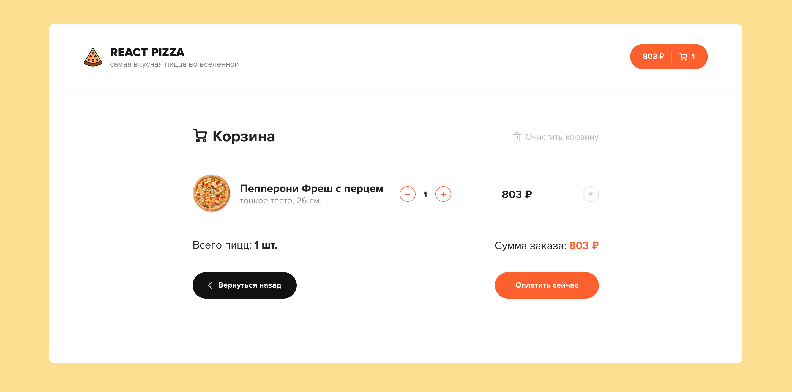
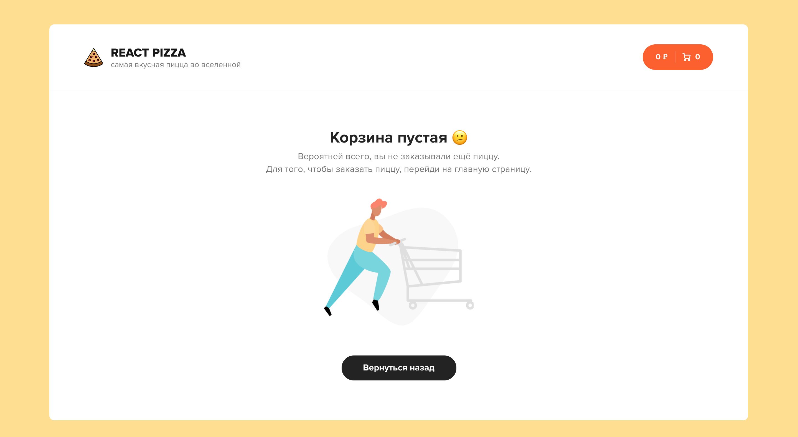

### Интернет-магазин по заказу пиццы - React Pizza :pizza:

---

### Запустить проект

```
npm run json-server
npm run start
```

> Хостинг проекта
> [Ссылка на проект](https://react-pizza-js.herokuapp.com/)

:arrow_right: :arrow_right: :arrow_right:

# :camera:





---

# :video_camera:

[](https://www.youtube.com/watch?v=bziVFvq8cLQ&list=PL0FGkDGJQjJFMRmP7wZ771m1Nx-m2_qXq)

---

**Stack:**

- [x] ReactJS + хуки
- [x] React Router
- [x] Redux
- [x] Redux thunk
- [x] json-server
- [x] Axios
- [x] classnames
